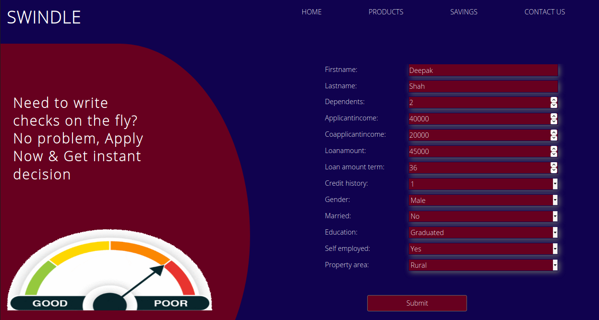

# Swindle
A new approach to banking technology that's fast, accurate and more agile.
Get your loan applocations approved faster and have the flexibility to learn from your customers as you grow. I present to you, Swindle loan app, a progressive web application powered by artifical intelligence to deliver loan applications faster. 

## Technology Stack
This application is developed in Python3. The stack is divided into three components:
1. Machine learning using python sikcit-learn 
2. Django web framework for backend development
3. HTML and CSS for frontend development

### Data Source
The dataset used in this project is taken from Loan Prediction and can be found at [a link](https://www.kaggle.com/ninzaami/loan-predication)

### Machine Learning:
The machine learning pipeline is divided into two python notebooks. The first is the data wrangling notebook which contains the data ingestion, exploratory data analysis, visualization and preprocessing. The libraries in this notebook are listed below.

* pandas 
* numpy
* matplotlib
* seaborn
* imbalanced-learn (must use pytorch or tensorflow backend for compatibility)
* pickle

The second notebook includes the algorithm training, hyperparameter tuning and evaluation. The libraries used in this notebook are the following:

* sklearn
* keras (must use pytorch or tensorflow backend for compatibility)


The last notebook is the production data test, a randomly synthesized dataset is fed into the model to test for validation before production.


### Web Development:
I use Django restframework to develop the backend.  which is very well written to build the application. Django comes with a list of middlewares to help streamline development process. 
The middlewares used in this project include: 
* csrf.CsrfViewMiddleware
* csrf.CommonMiddleware
* SessionMiddleware

### Instructions:
1. Open the project folder in any code editor (visual code, sublime, pycharm)

2. Activate virtual environment by running the following line of code 
```
cd venv/Scripts/activate
```
3. run the following command in terminal 

``` 
python manage.py runserver
```
4. You'll be promoted to follow a link which opens in your browser localhost (e.g.ttp://127.0.0.1:8000), click on it

5. Test it out


